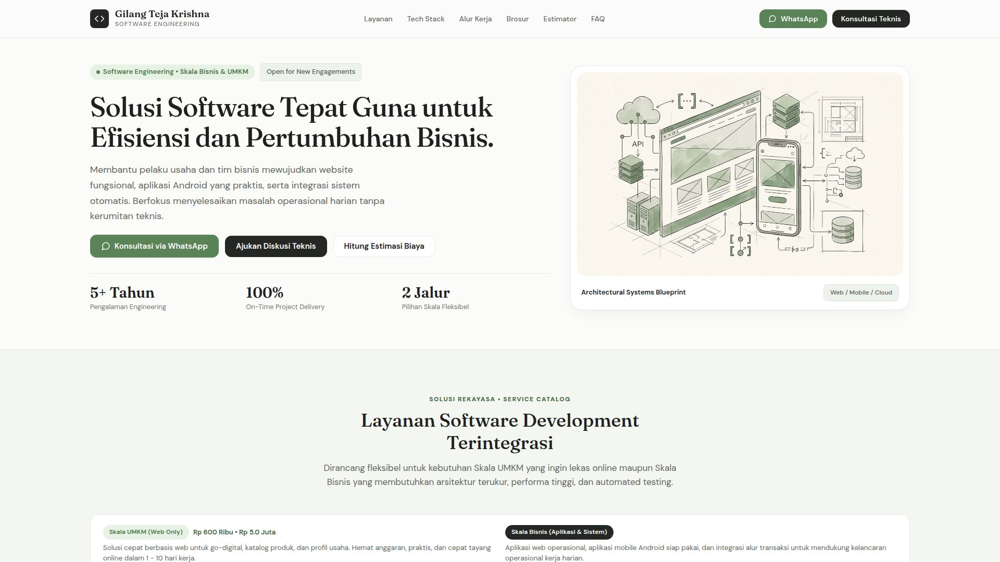
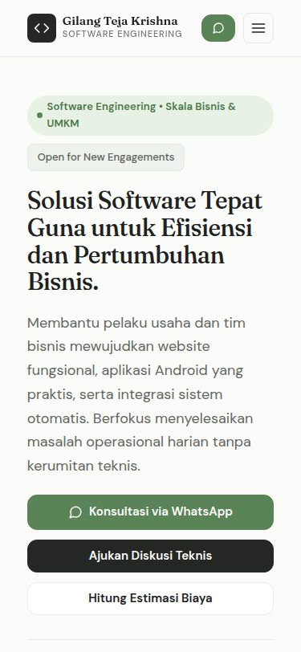
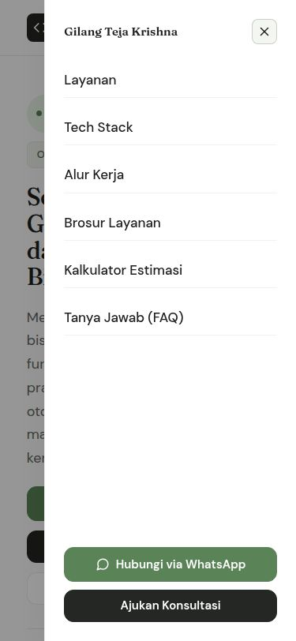
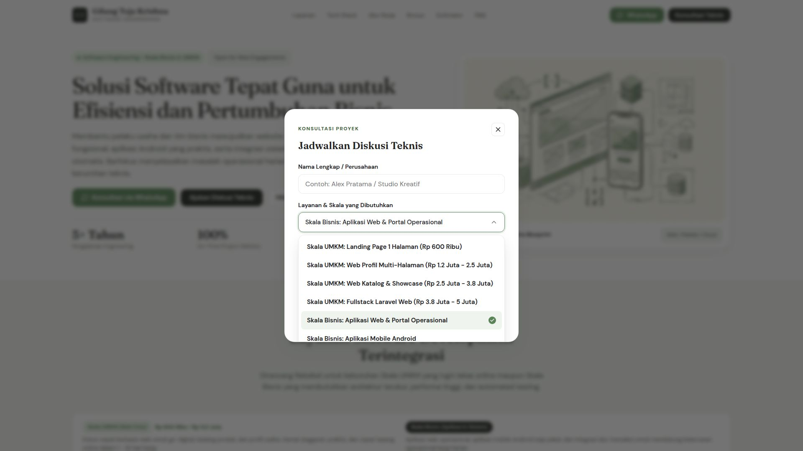
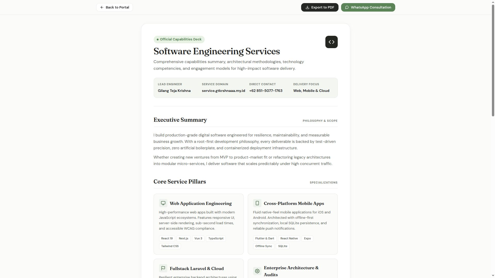
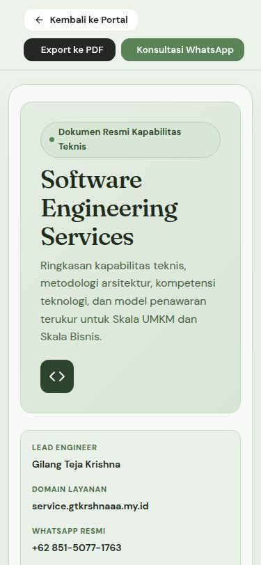
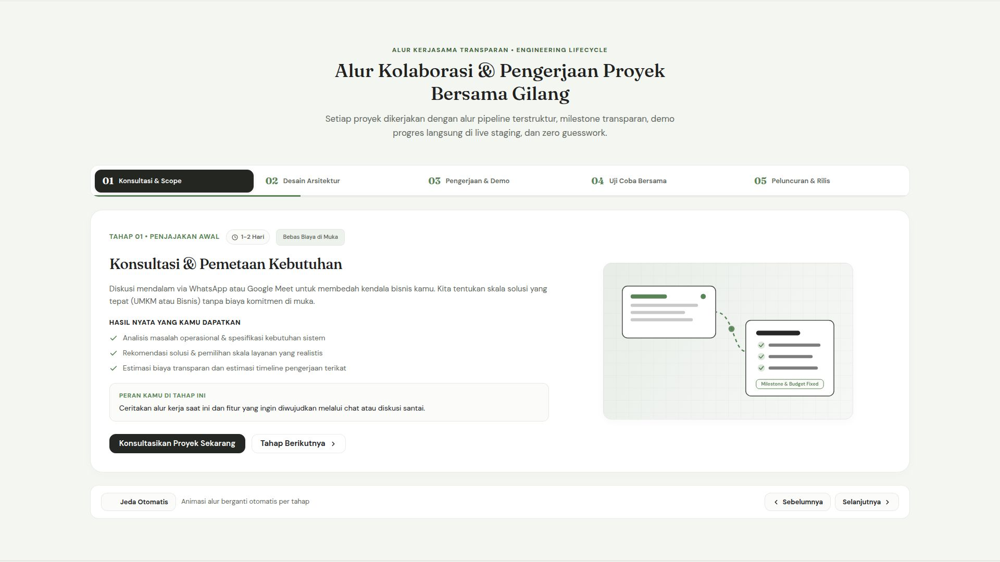

# Visual Interface & Capabilities Catalog

This document provides a visual walkthrough of the software engineering services web portal and capabilities brochure. All captures are generated via automated headless Chromium at standard 16:9 and mobile viewport profiles.

## Viewport Standards
- Desktop: 1920x1080 (16:9, High-DPI, Warm Editorial Light: `#fbfbfa`)
- Mobile: 375x812 (Touch Device, Responsive Stacked Layout)
- Archive: Dual-track storage in `docs/preview/screenshots/` and `docs/preview/screenshots.zip`

---

### 01. Main Landing Portal (Desktop Viewport)
Full desktop layout showcasing the 82% container width, hero section, dual-tier service catalog, tech stack badges, and execution workflow.

---

### 02. Main Landing Portal (Mobile Viewport)
Responsive single-column rendering optimized for mobile screens (375x812), featuring stacked service tiers, comfortable touch targets, and zero horizontal scrolling.

---

### 03. Mobile Navigation Drawer (Open State)
Slide-in off-canvas mobile navigation drawer with quick links and direct WhatsApp consultation dispatch.

---

### 04. Technical Consultation Modal & Service Selector
Accessible popover dialog featuring customized themed select dropdown with all UMKM and Business service options.

---

### 05. Official Capabilities Brochure (Desktop Viewport)
Official printable specification sheet formatted with technical pillars, competency matrix, workflow phases, and 4-tier UMKM + 3-tier Business pricing models.

---

### 06. Official Capabilities Brochure (Mobile Viewport)
Single-column responsive layout for mobile readers, featuring a two-row sticky action toolbar and stacked capability cards.

---

### 07. Interactive Collaboration Workflow Pipeline (Desktop Viewport)
Dynamic animated engineering process pipeline featuring 5-stage stepper, progress timer bar, SVG technical blueprints, and client role deliverables.

